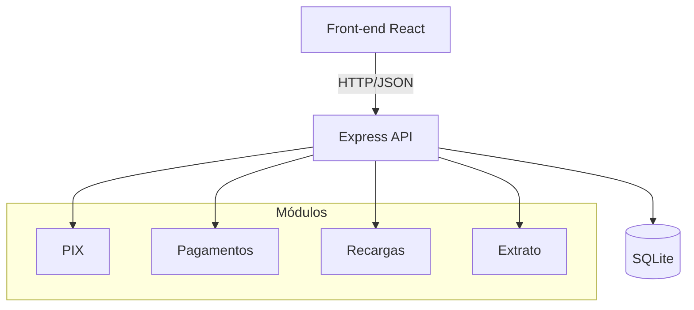
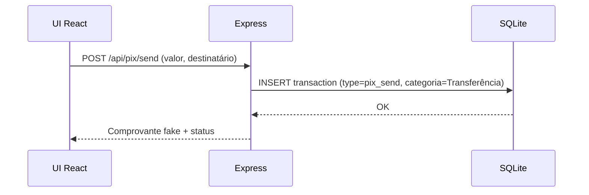
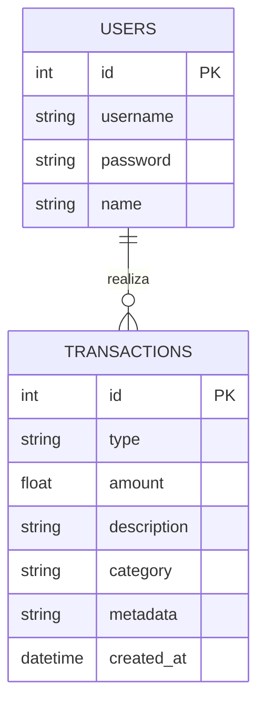

# Flux — Hub financeiro simulado

Aplicação full-stack que simula um hub financeiro móvel com identidade visual inspirada na paleta da Claro, mas com a marca **Flux**. O projeto inclui:

- **Front-end** em React + Vite com Tailwind CSS e Zustand.
- **Back-end** em Node.js/Express com banco **SQLite**.
- **API REST** cobrindo PIX (envio/recebimento), pagamento de contas, recarga de celular e extrato inteligente com categorização automática.
- **Gráfico de gastos por categoria** usando Chart.js.

## Estrutura de pastas
```
.
├── client/               # Front-end React
│   ├── src/components/   # UI reutilizável (header, cards, gráficos)
│   ├── src/pages/        # Telas (Login, Home, PIX, Pagamentos, Recarga, Extrato)
│   ├── src/services/     # Consumo da API REST
│   └── src/store/        # Zustand store
├── server/               # Back-end Express
│   ├── src/routes/       # Rotas da API
│   ├── src/db/           # Conexão e inicialização do SQLite
│   └── src/utils/        # Regras de categorização
└── data/                 # Arquivo do banco SQLite (criado em runtime)
```

## Como executar localmente
1. Instale as dependências em `server` e `client`:
   ```bash
   npm install --prefix server
   npm install --prefix client
   ```
2. Suba o back-end:
   ```bash
   npm run dev --prefix server
   ```
3. Em outro terminal, suba o front-end:
   ```bash
   npm run dev --prefix client
   ```
4. Acesse `http://localhost:5173` e use o login fake `fluxuser / 1234`.

> Variável opcional: `VITE_API_URL` para apontar o front ao back-end (padrão `http://localhost:4000/api`).

## API REST
| Recurso | Método | Rota | Descrição |
| --- | --- | --- | --- |
| Autenticação | POST | `/api/auth/login` | Login fake (fluxuser/1234) |
| PIX | POST | `/api/pix/send` | Simula envio e grava extrato |
| PIX | POST | `/api/pix/receive` | Simula recebimento e grava extrato |
| Pagamentos | POST | `/api/payments` | Registra pagamento de boleto |
| Recarga | POST | `/api/recharge` | Registra recarga de celular |
| Extrato | GET | `/api/transactions` | Lista transações ordenadas |
| Resumo | GET | `/api/transactions/summary` | Saldo + totais por categoria |

### Regras de categorização
- PIX enviado → **Transferência**
- PIX recebido → **Recebimento**
- Recarga → **Telefone**
- Pagamento → **Contas**

## Banco de dados (SQLite)
**Tabela `users`**
- `id` (PK)
- `username`, `password`, `name`

**Tabela `transactions`**
- `id` (PK)
- `type` (`pix_send`, `pix_receive`, `payment`, `recharge`)
- `amount` (positivo/negativo)
- `description`
- `category` (mapeada pelas regras acima)
- `metadata` (JSON com detalhes)
- `created_at` (timestamp)

## Telas
- **Login**: valida usuário fake.
- **Home**: saldo atual + atalhos para PIX, pagamentos e recarga.
- **PIX**: simula envio/recebimento com comprovante falso.
- **Pagamentos**: simulação de boleto/código de barras.
- **Recarga**: recarga de qualquer valor.
- **Extrato**: lista categorizada + gráfico de gastos por categoria.

## Diagramas
### Fluxo de alto nível (C4 / contexto simplificado)


### Diagrama de sequência (envio de PIX)


### Modelo E-R simplificado


## Identidade visual
- Primário: vermelho Claro `#ED1C24`
- Base: branco; texto/em todo: preto e cinza
- Botões arredondados, ícones simples, alto contraste e espaçamento confortável
- Marca “Flux” destacada no cabeçalho
